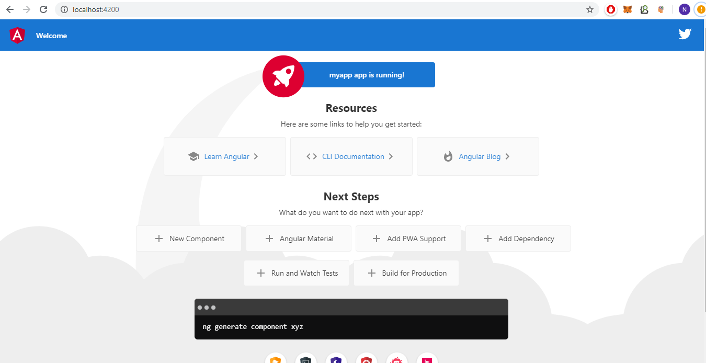
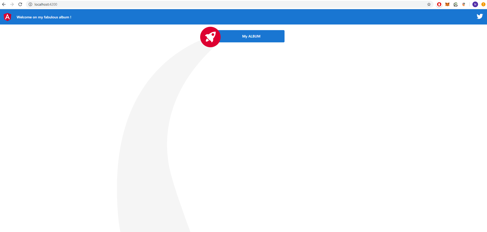
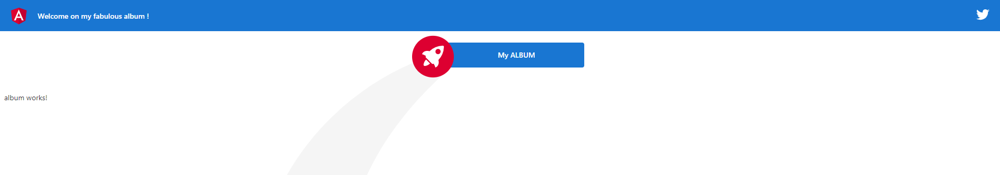
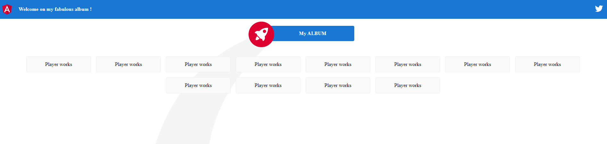
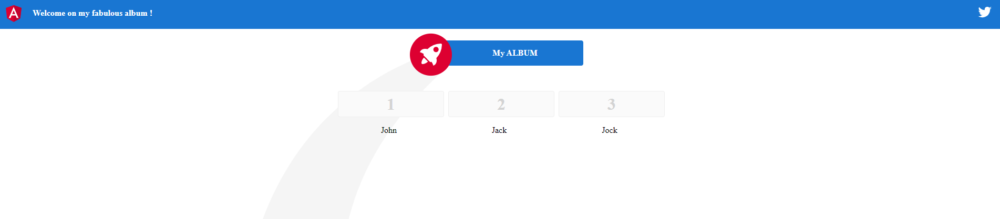
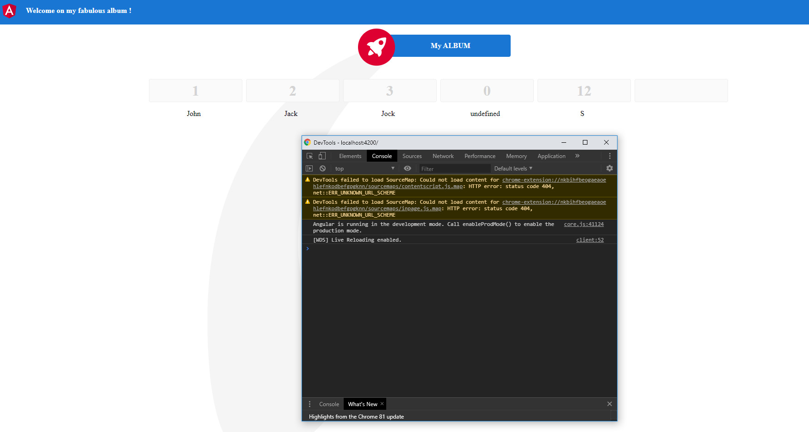
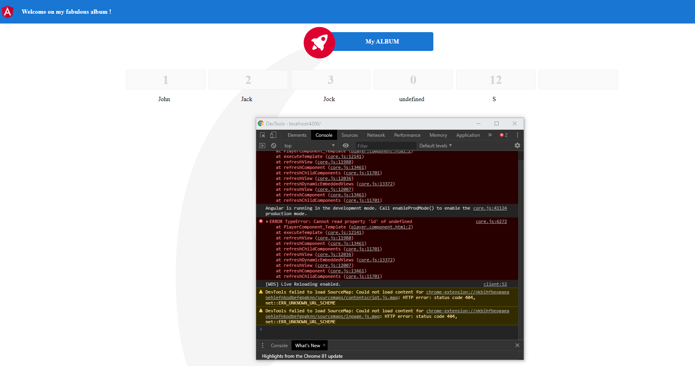
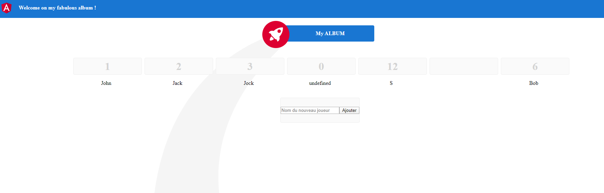
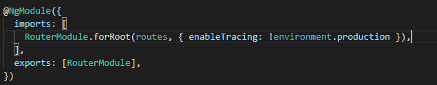
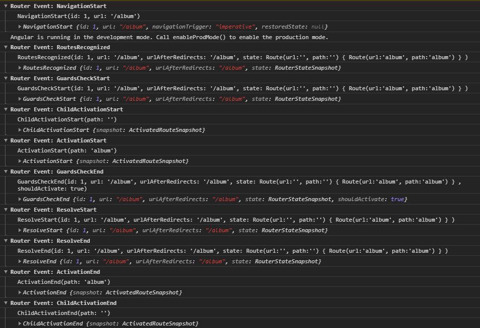

# TP 1 - Angular Création d'un album

Objectifs de ce TP :
- Utiliser angular CLI
- Maîtriser les composants (directives, binding, pipe, ...)
- Aborder les routes
- Créer un premier service

## Installer votre poste
1. Téléchargez et installez nodejs - https://nodejs.org/, npm est fourni avec :-).
2. Un IDE sera également nécessaire, de mon côté j'utilise Visual Studio Code (VSCode): https://code.visualstudio.com/.
3. Installez Angular CLI avec npm : `npm install -g @angular/cli`.

```
Annexes : 
L'ensemble des commandes pour Angular CLI sont ici : https://angular.io/cli.
Les commandes npm : https://docs.npmjs.com/cli/npm.
```
## Créer votre première application angular

1. Créez votre workspace pour le tp et placez vous dans ce dernier 
```
mkdir workspace
cd workspace
```

2. Initialisez votre application Angular avec l'angular CLI (Remplacez name par le nom de votre application).
```
ng new <name>
```

3. Ouvrez le répertoire généré avec votre IDE. Avec VSCode, vous pouvez ouvrir un terminal intégré. Placez vous à l'intérieur du projet au niveau du package.json avec votre terminal. Lancez votre application.
```
npm start
```
4. Vous pouvez également la lancer avec l'angular CLI : `ng serve`
   
5. Ouvrez votre navigateur internet à l'adresse : http://localhost:4200.

Vous devez arriver sur la page d'accueil par défaut offerte par angular.



```
/!\ Astuce : ng serve --open permet de lancer votre application et d'ouvrir votre navigateur directement. 
Vous pouvez changer la commande `npm start` grâce au package.json.
```

6. Modifiez le package.json pour que la commande npm start lance également votre navigateur.

## Vos premiers développements - Création de l'album

1. Modifiez la page d'accueil pour supprimer ce qui ne nous intéresse pas. Pour garder un peu de style, conservez les styles, le bandeau bleu et l'image en fond.



2. Créez un nouveau composant "album" avec angular cli

```
/!\ Astuce : Rangez tout vos composants dans un répertoire "components", générez vos composants en préfixant par le nom de dossier : components/<name> (components/album)
/!\ Astuce : Pour être plus rapide, ng generate component <name> est équivalent à ng g c <name> ! (Idem pour les services : ng g s, ...)
``` 

3. Appelez votre composant album depuis la page d'accueil.
Indice : Utilisez la directive (selecteur) du composant.



4. Créez un second composant "toolbar"

5. Déplacez le code html de la div toolbar de la vue app.component.html dans le template du nouveau composant toolbar.
6. Déplacez le code html de la div content de la vue app.component.html dans le template du nouveau composant album.
7. Appelez votre nouveau composant toolbar depuis la page d'accueil.

8. Vérifiez le résultat.
Les styles ne sont plus actifs, c'est dû au scope des composants. Un composant possède son propre scope et n'est pas partagé, on parle d'encapsulation. (Possibilité de changer ces contraintes grâce au ViewEncapsulation.) Il est possible de réunir les styles principaux à un endroit stratégie pour éviter de redéfinir les styles pour chaque composant.
9. Déplacez les styles de l'app.component.html dans le fichier styles.css (Sans les balises \<style>). Chaque composant possède ainsi ses surcharges css s'il souhaite personnalisé son affichage (fichier : `<name>.component.css`).

10. Revérifiez le résultat. Le code de votre app.component.html doit être très réduit.

```
<app-toolbar></app-toolbar>
<app-album></app-album>
<router-outlet></router-outlet>
```

## Création du composant Player

Un album contient plusieurs cartes (ici ce sont nos players), l'objectif ici sera d'initialiser un album avec plusieurs cartes.

1. Créez un nouveau composant "player"
   
2. Appelez le composant player plusieurs fois depuis l'album.

3. Arrangez les composants album et player afin d'avoir un affichage sous forme de carte (style card).



4. Modifiez le composant Player afin de lui jeter deux propriétés : un identifiant (id) et un nom (name).
   
5. Ajoutez une propriété "players" à l'album représentant un tableau de joueurs. Ajoutez plusieurs joueurs à ce tableau.

6. Utilisez la directive ngFor et le property binding (Parent->Child) pour initialisez correctement le composant "Player".

Contraintes :

Utilisez le css du composant player :
- pour arranger le nom du joueur pour qu'il soit centré, celui-ci doit être contenu dans une balise \<p>.
- pour modifier la couleur de l'identifiant pour qu'il soit en "lightgray", celui-ci doit être contenu dans une balise \<h1>.

Example : 
Si j'initialise un tableau [{ name: 'John', id: '1' }, { name: 'Jack', id : '2' }, { name: 'Jock', id: '3' }] en tant que propriété de mon composant album,
je dois retrouver une carte par élément de mon tableau au niveau du rendu final. (Hello Jock ;) !)



## Utilisons un modèle !

Imaginez un composant avec plus d'une cinquantaine d'attributs, les templates souhaitant utiliser ce composant devront binder chaque propriété !
Cela risque d'être lourd et de complexifié le code produit. Favoriser plutôt l'utilisation d'un modèle.

1. Créez un modèle "player" avec les attributs id et name.
   
```
/!\ Astuce : utilisez angular cli pour créer un modèle : ng g class models/player
```

2. Modifiez les composants pour importer le nouveau model et supprimer les attributs "name" et "id" des composants. Profiter de TypeScript pour typer les objets dans les composants.
3. Modifiez le binding au niveau du template du composant album.

Objectif : Factorisez votre code avec l'utilisation d'un modèle pour le composant Player. Cela offrira une interface compréhensible et clair.

## Model v2

1. Modifiez votre code (model & composant) pour que l'initialisation du tableau suivante fonctionne correctement :

```
  players: Player[] = [
    { name: 'John', id: 1 },
    { name: 'Jack', id: 2 },
    { name: 'Jock', id: 3 },
    new Player(),
    new Player(12, 'S'),
    undefined,
  ];
```

Objectif :



```
/!\ Attention, en ouvrant la console développeur du navigateur (F12), il ne doit pas y avoir d'erreur !
```

Exemple d'erreur :



## Votre premier formulaire - Ajouter un joueur à mon album

1. Ajoutez un formulaire et un bouton au template de l'album afin d'ajouter dynamiquement une carte possible à votre album.

Objectif : 
Lors du clic sur le bouton ajouter, un nouveau joueur est créer avec un id généré de façon séquentiel (1, 2, 3, ...).
Le nouveau joueur s'affiche dans l'album et le formulaire est vidé.




2. Améliorez votre formulaire pour refuser l'ajout d'un joueur si le nom n'est pas renseigné.
   
3. Affichez un message d'erreur en rouge à l'utilisateur s'il appuie sur le bouton ajouter sans renseigner le nom.
   
4. Faite disparaître ce message dès qu'il commence à renseigner le nom.

/!\ Ceintures & Bretelles /!\

5. Améliorez encore une fois votre formulaire pour afficher ou masquer (ou bien désactiver le click) le bouton ajouter en fonction de si l'utilisateur à renseigner le nom du joueur.

```
/!\ Note : Ici ce ne sont que des protections au niveau du front, rappelez-vous que le code du front tourne au niveau du navigateur de votre PC. Il est très facile de bypasser ces protections en modifiant le DOM directement depuis votre navigateur grâce à la console développeur par exemple.
D'un point de vue sécurité, rappelez-vous qu'il faut toujours protéger les données au niveau du serveur ! 
Protéger vos apis en controlant les inputs utilisateurs ;-) !
Les contrôles au niveau du frontend comme on fait ici ne sont que pour le confort de l'utilisateur et l'ergonomie de l'application.
```

## Votre première route

1. Créez un composant représentant une page 404 simple (appeler le page-not-found)
```
<div class="content" role="main">
  <h1>404 Not found.</h1>
</div>
```


2. Modifiez le template de votre RootComponent (`app.component.html`) pour qu'il ressemble à ça : (il suffit de supprimer l'appel au composant album)
   
```
<app-toolbar></app-toolbar>
<router-outlet></router-outlet>
```

Objectif :

3. Créez deux routes :
- une route par défaut redirigeant vers votre nouvelle page 404
- une route /album/ redirigeant vers votre composant album

```
/!\ Astuce : celà se passe au niveau du app-routing.module.ts
```

4. Rajoutez deux raccourcis (\<a>) au niveau de la toolbar pour rediriger un raccourci vers l'album et l'autre vers votre page 404.

5. Ajoutez une route '' pour rediriger vers la page album.


```
/!\ Astuce : en développement vous pouvez ajouter la variable enableTracing au niveau de l'import des routes pour débuguer vos routes, attention à ne pas l'activer en production !
Utiliser la variable d'environnement pour savoir si vous êtes en production ;-) !
```




6. Retournez sur la page Album.
Ajouter des joueurs. Naviguer sur la page 404 et revener sur la page Album.
7. Que s'est-il passé ? Hésitez pas à me répondre en message privé sur le chat.
Indice : Cycle de vie !
8. Implémentez l'interface OnDestroy et surcharger la méthode pour ajouter un log afin de vérifier à quel moment cela se produit.

## Votre premier Service (stateful !) avec l'utilisation d'Observable !

Angular est un framework SPA (Single Page Application), c'est-à-dire qu'on récupère l'application sur le navigateur une seule fois, on ne retélécharge pas les éléments statiques (html/css/js/ressources/...) à chaque navigation.
Et même si Angular est SPA, il est tout de même intelligent pour détruire et construire les composants au bon moment. Cela permet de garder un bon niveau de performance. Une sorte de Garbage Collector :-).

Pour conserver les états de certaines données, il faut alors utiliser un service stateful.

Pour information, nous allons ici créer notre premier service stateful pour conserver les données mais il faut savoir que généralement, on utilise une libraire supplémentaire ajoutée à Angular pour gérer l'état global de l'application (librairie les plus connus : NGRX, NGXS, Akita).
On préfère garder ainsi les services de manière stateless.

1. Créez votre premier service : album.
2. Ajoutez deux propriétés au service :
- players, un tableau de Player
- tracker, un subject du tableau (`private tracker = new BehaviorSubject<Player[]>(this.players);`)
3. Ajoutez deux méthodes au services :
- getPlayers(), retournant un `Observable<Player[]> (return this.tracker.asObservable();)`
- addPlayer(player: Player): void, permettant d'ajouter un player au tableau et d'appeler la méthode next du tracker avec en paramètre le tableau.

4. Utilisez maintenant le service dans le composant album.

```
/!\ Indice : Dependency Injection, constructeur !
/!\ Indice : utiliser la méthode ngOnInit pour souscrire à l'observable et mettre à jour les données.
```

5. Lors d'un ajout d'un player, utiliser la méthode du service pour ajouter le player et laissez la magie de l'Observable opérer :-).

Objectif : ajoutez des joueurs à l'album et en naviguant à travers les pages, l'état de l'album est conservé.

## Dernière étape !

1. Améliorez votre composant Player afin d'autoriser l'ajout d'image représentant l'image du player (tel un album panini). Laissez libre cours à vore imagination, réaliser un album des professeurs du département informatique de l'INSA ;-) ! 
2. Le but étant de pouvoir ajouter à votre album une image une fois que vous l'avez obtenu, ajoutez un bouton pour ajouter une carte qui affiche un formulaire pour ajouter l'image (une référence URL sur internet suffira) et la date d'obtention de votre image (qui correspond à la date actuelle).
3. Enrichissez votre modèle player avec deux propriétés : image et date.

## Bonus :
Qu'en y'en a plus, y'en a encore !
1. Ajoutez une fonction pour modifier le nom d'un joueur voir la possibilité de supprimer un joueur.
2. Créez un Pipe pour afficher le nom des joueurs en majuscule sur le composant Player.
