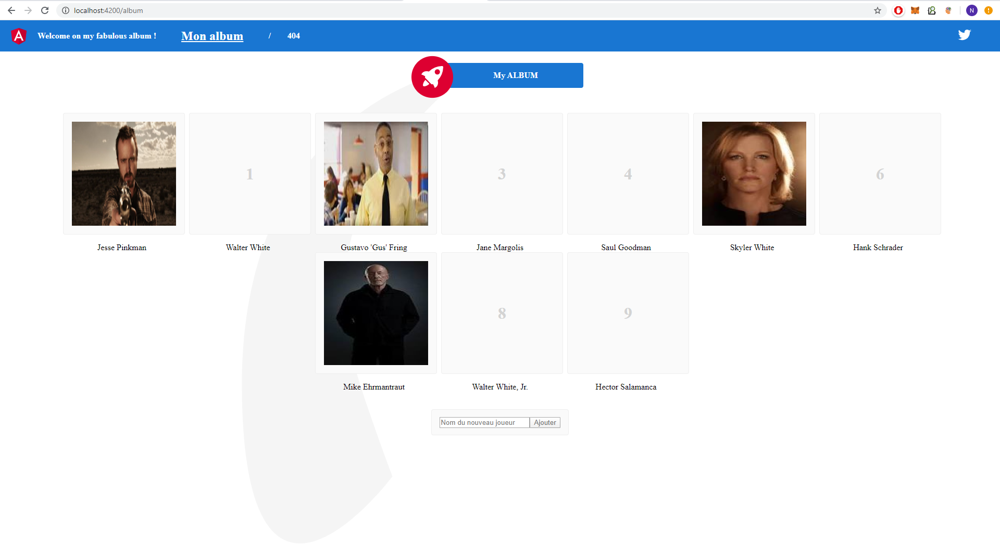
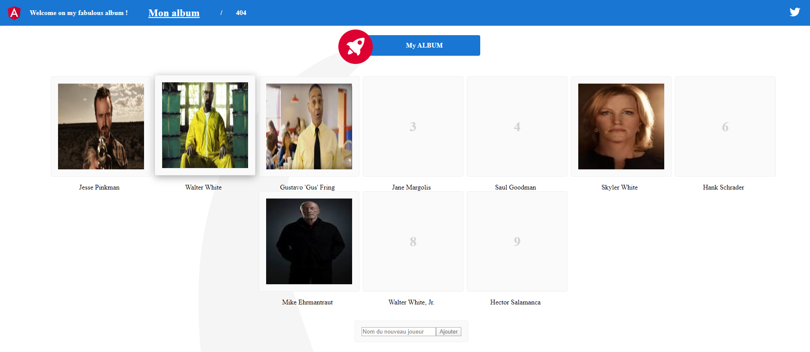
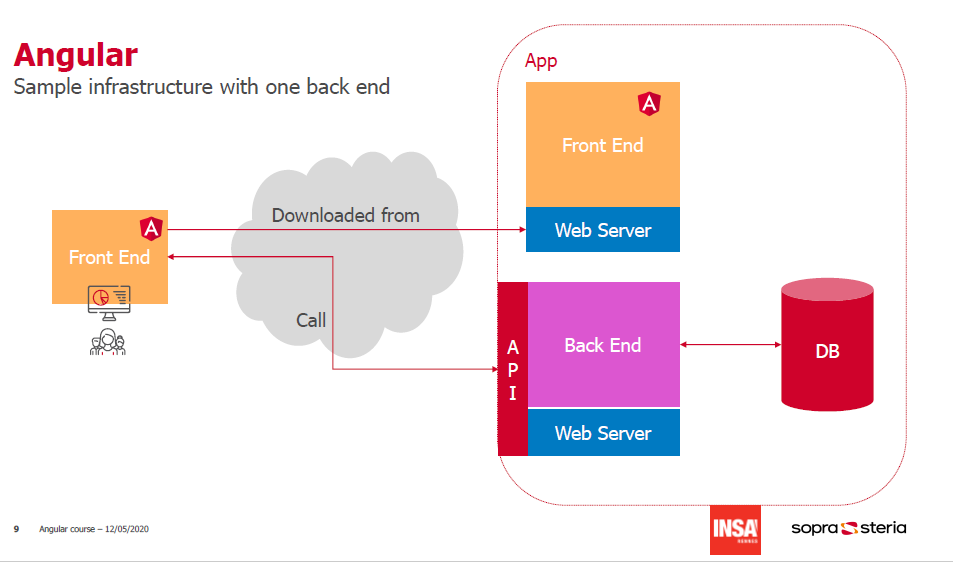
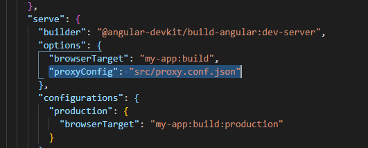
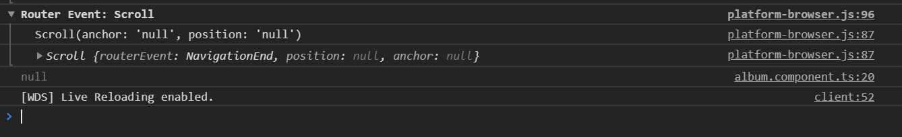
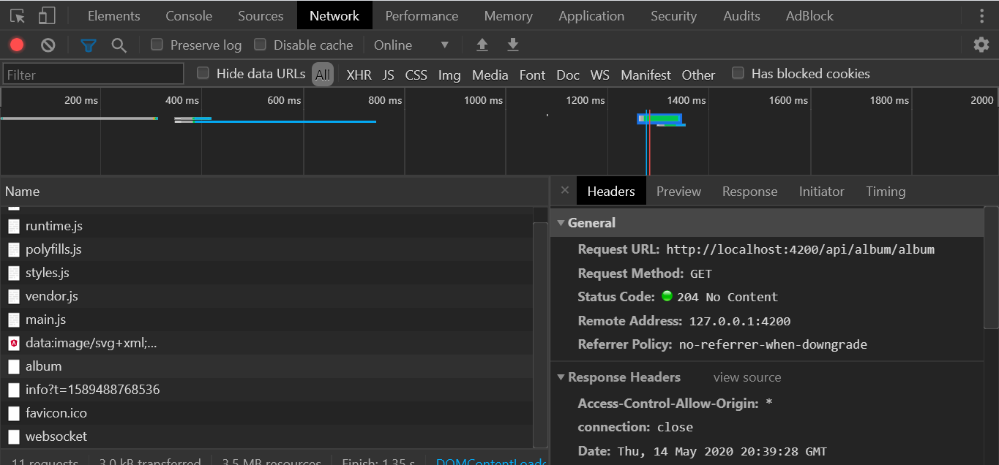
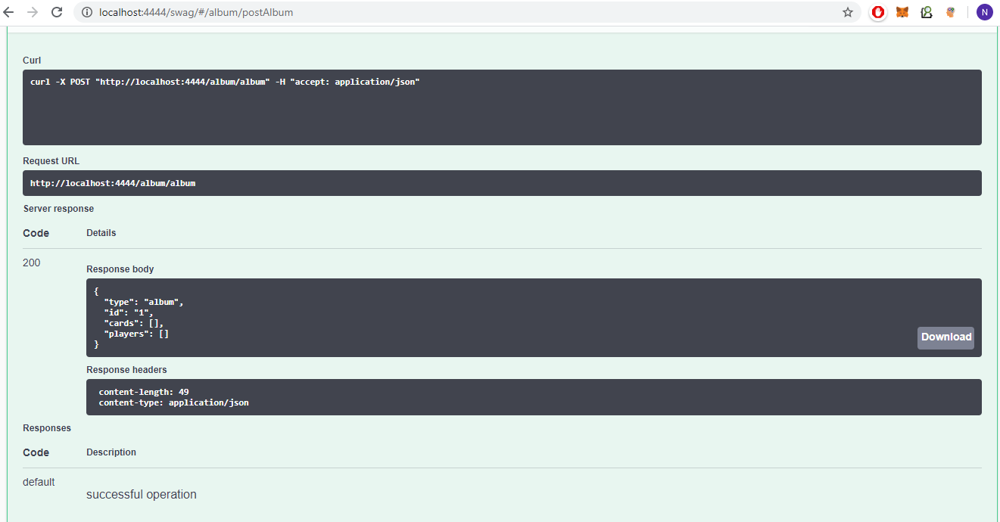
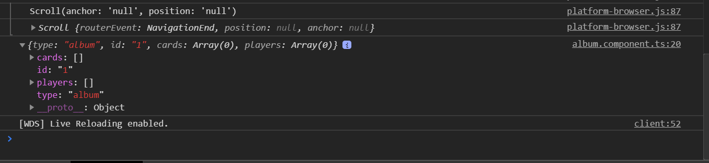
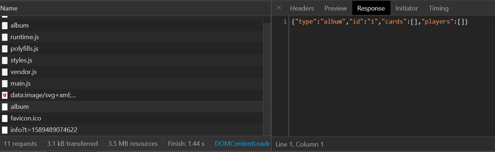
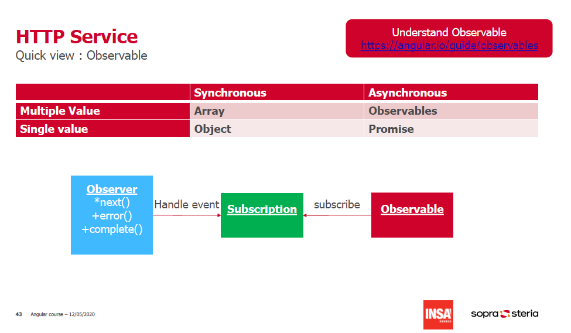

# TP 2 - Création d'un album avec Angular

Objectifs de ce TP :

- Utiliser angular CLI
- Maîtriser les services
- Utiliser le backend album développé
- Aborder les appels APIs
- Aborder les Observables

## Pré-requis : Démarrer votre backend

1. Récupérez le projet backend

`git clone https://github.com/arnobl/WebEngineering-INSA.git`

2. Démarrez votre backend

```
cd WebEngineering-INSA\rest\jersey\example
```

Utilisez l'option avec laquelle vous êtes à l'aise.

- Option 1 : Compilez avec maven : `mvn clean install` et Déployez le WAR compilé vers votre serveur local (Tomcat ...)
- Option 2: Ou démarrer votre serveur depuis Eclipse / IntelliJ directement (Run as Java application).

3. Vérifiez que votre serveur backend est bien accessible.
   Consulter le swagger : http://localhost:4444/swag/

4. Vérifiez que vos apis fonctionnent. (Try it out : GET album/album)

## 1 - Repartons sur de bonnes bases

Vous pouvez réutilisez ce que vous avez développé lors du premier TP, cependant il risque d'y avoir quelques conflits lors des prochaines consignes de ce TP. Pour vous faciliter la tâche, un squelette vous est fourni.

`git clone https://github.com/n-charpentier/tp-insa-angular-myalbum.git`

1. Installez votre application avec la commande `npm install`.
2. Lancez votre application en local avec `npm start` (http://localhost:4200)

```
/!\ Info : La commande npm install permet la récupération des dépendances de votre projet (déclarées dans votre package.json) depuis internet.
L'effet de cette commande va créer un répertoire node_modules qui contiendra l'ensemble des dépendances de votre projet.
```

Pour rappel, l'application représente un album d'images. Pour la démonstration, prenons en exemple un album de Breaking Bad.

L'application permet d'ajouter des personnages sans images vous permettant de créer la structure de votre album. Ici, 9 personnages sont disponibles et déjà 4 personnages ont été trouvés.

- Pour ajouter un personnage, il suffit de remplir au niveau du formulaire le nom du personnage et de cliquer sur "Ajouter".



- Lorsque vous trouvez une image dans votre pochette fraîchement achetée chez votre commerçant du quartier, vous pouvez compléter votre album en ajoutant l'image trouvée. Il suffit de cliquer sur la carte du personnage et d'ajouter l'URL de l'image dans l'input text prévu et d'appuyer sur la touche "Entrée" de votre clavier.


- Exemple où ici, Walter White a été trouvé.
- Heisenberg : `Now, say my name.`



`P.S : Je vends mes doubles.`

## 2 - Bien comprendre le service stateful (Rappel TP1)

Revenons dans un état précédent

1. Modifiez le code de l'`album.component.ts` pour qu'il ressemble à ça (faite un copier coller sans faire attention au code actuel).

```
import { Component, OnInit, OnDestroy } from '@angular/core';
import { Player } from 'src/app/models/player';

@Component({
  selector: 'app-album',
  templateUrl: './album.component.html',
  styleUrls: ['./album.component.css'],
})
export class AlbumComponent implements OnInit, OnDestroy {
  players: Player[] = [];

  constructor() {}

  ngOnInit(): void {}

  addPlayer(name: string): void {
    this.players.push(new Player(this.players.length, name));
  }

  ngOnDestroy(): void {
    console.log('Destroyeed.');
  }
}
```

2. Manipulez l'album, ajoutez quelques joueurs, des images...
3. Naviguez sur la page '404', et revenez vers la page 'Mon album'. Que s'est-il passé ?

Indice : SPA & Cycle de vie (Voir TP1)

4. Essayez, sans tricher, de reconstruire le code de l'`album.component.ts`, pour cela :

   1. Importez l'AlbumService déjà créé pour vous !
   2. Utilisez l'injecteur de dépendance ! Déclarez le service AlbumService dans le constructeur du composant AlbumComponent (cf cours).
   3. Implémentez la méthode `ngOnInit()` pour initialiser la variable players avec les données du service (indice : `observable.subscribe(observer)`).
   4. Modifiez la méthode `addPlayer(name: string)` pour appeler la méthode `addPlayer(player: Player)` du service.

5. Refaire l'étape 2. et 3. (Manipulation, page '404', page 'Mon album'). Quelle est la différence ? Expliquez pourquoi.

6. Rafraîchir l'application avec votre navigateur. Que s'est-il passé ? Expliquez pourquoi.

## 3 - Liaison avec le backend

L'objectif de se chapitre est de lié notre application frontend avec notre backend de l'album.

```
Petit rappel du cours : même si ici vous êtes en local, votre frontend est récupéré par votre navigateur depuis un serveur (local ici, servi grâce au `ng serve`) et son code est exécuté sur votre machine personnel via votre navigateur.
Le backend expose des APIs que vous pouvez consommer mais le code du backend est exécuté sur le serveur (local, ici via votre serveur Tomcat ou votre Eclipse/IntelliJ).
```



### Configuration de l'HTTP Service

Afin de pouvoir appeler les APIs du backend, nous allons devoir configurer notre application pour qu'elle puisse requêter nos APIs.

1. Dans la classe `app.module.ts`, importez le module `HttpClientModule` de la librairie `@angular/common/http` (après le `BrowserModule`).

```
/!\ Astuce : utilisez les outils de votre IDE pour importer facilement.
N'oubliez pas l'import au niveau du décorateur @NgModule
```

2. Le `HttpClientModule` possède un service `HttpClient` injectable. Injecter le dans le constructeur du service `album.service.ts`.

```
/!\ Indice : Injection de dépendances !
```

```
/!\ Les étapes qui suivent ne vont pas fonctionner directement, c'est normal ! Ces étapes sont là pour vous faire découvrir pourquoi cela ne fonctionne pas.
```

3. Configurez une propriété url pour le service (`album.service.ts`) pour pointer vers l'url de l'api album/album de votre backend.

```
private url = 'http://localhost:4444/album/album';
```

4. Créez une fonction getAlbum au niveau du service pour appeler l'API grâce à l'HttpClient que vous avez injecté. (Le nom de ma propriété HttpClient est http.)

```
getAlbum() {
  return this.http.get(this.url);
}
```

5. Appelez cette nouvelle fonction lors de l'initialisation du composant album (`album.component.ts` méthode `ngOnInit()`). Logguez simplement le résultat dans la console.

C'est cadeau car c'est le premier ;) !

```
this.svcAlbum.getAlbum().subscribe(x => console.log(x));
```

6. Retournez sur votre navigateur et vérifiez votre console de développeur.

Que constatez-vous ?

```
Vous devriez avoir ce genre d'erreur :
```


```
Explications : Une protection au niveau de votre serveur est activée.
Celle-ci s'appelle le « Cross-Origin Resource Sharing » (CORS) et permet de protéger les ressources des appels scriptés provenant d'un domaine différent.
Mozilla l'explique mieux que moi : https://developer.mozilla.org/fr/docs/Web/HTTP/CORS

C'est une sécurité que vous allez souvent rencontrer si vous faites des développements web.

Il existe plusieurs solutions pour contourner notre problème ici en local, comme par exemple paramétrer votre serveur en ajoutant une entête HTTP Access-Control-Allow-Origin et de paramétrer votre service Http Angular pour qu'il envoie les bon headers. Mozilla l'explique encore mieux que moi : https://developer.mozilla.org/fr/docs/Web/HTTP/Headers/Access-Control-Allow-Origin

Cependant, pour réaliser cette modification, il faut pouvoir avoir accès au serveur source. Ici, c'est possible car nous sommes en local, mais bien souvent, vous n'aurez pas la main dessus.

Nous allons voir ici une autre solution, efficace pour les développements, côté frontend, pour ajouter un proxy Angular entre nos scripts Angular et l'appel à l'API.
```

### Configuration du proxy

Nous allons ici paramétrer notre proxy pour rediriger toutes les requêtes `localhost:4200/api/*` vers notre serveur backend pour consommer ses apis (`localhost:4444`).

1. Créez un fichier `proxy.conf.json` sous le répertoire `/src/` de votre application avec le contenu suivant.

```
{
  "/api/*": {
    "target": "http://localhost:4444/",
    "secure": false,
    "changeOrigin": true,
    "logLevel": "debug",
    "pathRewrite": {
      "^/api": ""
    }
  }
}
```

Le nom des propriétés parlent d'elles-mêmes :

- L'objet est préfixé par le nom de la route (/api/\*) à "observer" par le proxy, vous pouvez déclarez plusieurs routes mais attention à ne pas cafouiller avec vos routes angular.
- target : URL cible de renvoi.
- secure : pour activer / désactiver https.
- changeOrigin : si vous souhaitez rediriger vers un domain différent (ici localhost).
- logLevel : pour afficher les traces.
- pathRewrite : expression régulière à remplacer : remplacer par (exemple "/api" sera remplacé par "").

Pour plus d'infos : https://angular.io/guide/build

2. Déclarer votre proxy au niveau du fichier `angular.json`.

```
"proxyConfig": "src/proxy.conf.json"
```



3. Redémarrez votre application (`Ctrl+C` pour stopper, `npm start` pour redémarrer)

```
/!\ Attention : Chaque modification de configuration du proxy ou de modification du fichier angular.json nécessitera un redémarrage de votre application.
```

4. Modifiez l'URL du service `album.service.ts`.

```
private url = '/api/album/album';
```

5. Retentez l'expérience : ouvrez votre application et votre console développeur. Un log "null" devrait apparaître (sauf si lors de vos tests des appels APIs vous avez déjà fait un `POST album`)



6. Vérifiez votre onglet Network de votre console développeur.



```
Bonne nouvelle, il n'y a plus d'erreur :-).
```

7. Créez votre album (`POST album`) avec votre swagger (http://localhost:4444/swag/)



8. Rafraîchissez votre application sur votre navigateur.



```
Bonne nouvelle, vous avez un vrai log !
```

9. Vérifiez votre onglet Network pour constater la différence ;-) !



```
Bien joué, vous avez réalisé votre premier appel API avec Angular, les choses sérieuses commencent.
```

## 4 - Bien observer l'observable.

Rappel du cours.



1. Modifiez le code du composant album `album.component.ts` lors de son appel à la méthode `getAlbum()` du service pour qu'il ressemble à ça : (enlever le subscribe et le log).

```
this.svcAlbum.getAlbum();
```

2. Rafraîchissez votre application et observez ce qu'il s'est passé dans l'onglet Network de votre console développeur. L'appel à l'API a-t-il été réalisé ?

3) Remodifier votre code, et constastez les différences.

```
this.svcAlbum.getAlbum().subscribe(
  (x) => console.log(x),
  (err) => console.error(err),
  () => console.log('complete')
);
```

4. Essayez de produire une erreur (en coupant votre backend par exemple ou en modifiant l'url vers une fausse URL) pour afficher le log d'erreur.

5. Toujours dans la méthode `ngOnInit()` du composant album, créez un nouvel observable (timer) et observez ce qu'il se passe dans votre console développeur.

Pour vous aider :

N'oubliez pas les imports à placer dans la classe de votre composant ;-) :

```
import { Observable, timer, Subscription, Observer } from 'rxjs';
```

Le code à placer dans le ngOnInit() :

```
    const observable = timer(5000);
    const observer = {
      next: (x) => console.log(x),
      error: (err) => console.log(err),
      complete: () => console.log('End.'),
    };
    observable.subscribe(observer);
```

`Le timer se déclenchera au bout de 5 secondes avec la valeur 0.`

6. Modifiez la valeur observable, et révérifiez votre console :

```
const observable = timer(5000, 1000);
```

`Le premier timer se déclenchera au bout de 5 secondes avec la valeur 0 puis toutes les secondes en incrémentant la valeur de 1.`

7. Naviguez plusieurs fois entre la page album et la page 404. Vérifiez votre console. Que se passe-t-il ?

```
/!\ Attention : maitrîsez bien vos observables.

  L'implémentation des observables proposée par RxJS est très pratique, par contre il faut faire attention à bien prévoir les destructions de souscription aux observables.
  Ceux-ci se détruisent eux-même s'ils recoivent un évènement "complete", mais sinon, ils restent actifs et parfois de manière invisible.
  En effet, ceux-ci ne sont pas automatiquement détruit avec les composants.
  Le risque étant de faire perdurer des objets indéfiniment dans le temps sans qu'ils soient recyclés par le garbage collector.
  Au bout d'un moment, cela pourrait provoquer des fuites mémoires faisant augmenter la mémoire de votre navigateur jusqu'au plantage.

/!\ Pratique : l'implémentation de l'observable d'un appel API à travers l'HttpClient provoque un appel à la méthode complete de l'observer dès que cet appel est terminé.
```

8. Corrigez cet effet, pour unsubscribe lors de la destruction du composant album (méthode `ngOnDestroy()`).

Pour vous aidez, voici le code de mon composant `album.component.ts`

```
import { Component, OnInit, OnDestroy } from '@angular/core';
import { Player } from 'src/app/models/player';
import { AlbumService } from 'src/app/services/album.service';
import { Observable, timer, Subscription, Observer } from 'rxjs';

@Component({
  selector: 'app-album',
  templateUrl: './album.component.html',
  styleUrls: ['./album.component.css'],
})
export class AlbumComponent implements OnInit, OnDestroy {
  players: Player[] = [];
  souscription: Subscription;

  constructor(private svcAlbum: AlbumService) {}

  ngOnInit(): void {
    this.svcAlbum.getPlayers().subscribe((players) => {
      this.players = players;
    });

    this.svcAlbum.getAlbum().subscribe(
      (x) => console.log(x),
      (err) => console.error(err),
      () => console.log('complete')
    );

    const observable: Observable<number> = timer(5000, 1000);
    const observer: Observer<number> = {
      next: (x) => console.log(x),
      error: (err) => console.log(err),
      complete: () => console.log('End.'),
    };
    this.souscription = observable.subscribe(observer);
  }

  addPlayer(name: string): void {
    this.svcAlbum.addPlayer(new Player(this.players.length, name));
  }

  ngOnDestroy(): void {
    this.souscription.unsubscribe();
  }
}
```

## 5 - Multiplication des pains.

`The path to the stateless service.`

APIs à gogo ! Revenons à nos moutons.

Amusez-vous maintenant avec vos services APIs.

1. Lors de l'initialisation du composant album, lors du `GET album/album`, vérifiez que l'album récupéré existe bien, dans le cas contraire réalisé un `POST album/album` avec Angular.

```
/!\ Indices :
-  il faudra créer une nouvelle méthode dans le service album pour utiliser l'api POST album/album
-  il faudra mettre à jour votre composant album pour créer un album s'il n'existe pas.
-  contrairement à http.get(url), la méthode http.post attend au minimum deux paramètres http.post(url, data), les data doivent correspondre à votre contrat d'interface swagger.


/!\ Astuce : hésitez pas à créer plusieurs propriétés pour les urls.

Example :

  private base_url = '/api/album';
  private get_post_album = this.base_url + '/album';
  private post_player = this.base_url + '/player';
  private post_player_card = this.base_url + '/playercard';
```

2. Modifiez le service album pour que la méthode `getPlayers()` fasse un appel à l'api GET album/album et retourne uniquement les players de l'album de l'api.

```
/!\ Aide : il faut utiliser les manipulations observables proposés par RxJS pour récupérer uniquement les players de l'album (voir contrat d'interface).
```

Code attendu pour la méthode getPlayers du service :

```
getPlayers() {
  return this.http.get(this.url).pipe(map((album: any) => album.players));
}
```

3. Modifiez la méthode `addPlayer()` du service pour qu'il utilise l'api `POST album/player`.

```
/!\ Attention, le retour de l'api est en XML !

Par défaut, le client http est configuré pour recevoir du json, il faut donc lui indiquer qu'ici, on s'attend à recevoir du xml. Il faut utiliser les HttpHeaders nécessaires ({ responseType : 'text'}).

Je vous invite à consulter l'interface de l'http client qui se trouve dans vos node_modules pour mieux comprendre : node_modules\@angular\common\http\http.d.ts

```

Code attendu pour la méthode addPlayer du service :

```
  addPlayer(player: Player): Observable<any> {
    console.log({ name: player.name });
    return this.http.post(
      this.post_player,
      { name: player.name },
      { responseType: 'text' }
    );
  }
```

Modifiez maintenant votre composant album pour qu'après l'ajout d'un player, le composant récupère l'album à jour.

```
/!\ Info : Ici nous ne traitons pas directement le retour xml de l'api. Sachez qu'il est possible d'utiliser un parser xml pour convertir le retour en json. Je vous recommande xml-js : https://www.npmjs.com/package/xml-js.

Dans la vraie vie, si vous avez la main sur le backend, essayez d'être homogène et tout implémenter en json directement. Dans quelques cas, il faudra utiliser un parser.
```

4. Implémentez une nouvelle méthode `addImage(p: Player, image: string, date: Date` pour le service `album.service.ts` afin qu'il appelle l'api `POST /album/playercard/{playerid}/{date}/{front}/{back}`

```
/!\ La donnée date doit recevoir une date dans un format spécifique.
/!\ La donnée front et back attendent un string (une url) correspondant respectivement à l'image de devant et l'image de derrière, pour vous faciliter la tâche considérer qu'il n'y a qu'une seule image et donc que l'image front est la même que l'image back (renvoyez deux fois la même url de l'image).

/!\ Attention, ici l'api a besoin des données dans le path de l'URL.
Le fait que la date soit en paramètre est un peu étrange, hésitez pas à modifier votre backend pour modifier si ça bloque.
```

5. Modifiez le composant Player pour qu'il appelle cette nouvelle méthode, c'est à dire que lorsque vous ajoutez une image, il appelle le service.

6. Assurez-vous que tout reste dynamique, le but final étant que votre service album ne contient plus les propriétés `players` et `tracker` mais fasse uniquement des appels aux APIs. Le service sera alors `stateless`.

```
Objectifs - Suppression de ces lignes dans le service.
  private players: Player[] = [];
  private tracker = new BehaviorSubject<Player[]>(this.players);

```

## Bonus

- Utilisez le pipe async au niveau du template de l'album pour réduire le code de sa classe. (https://angular.io/api/common/AsyncPipe)
- Utilisez le parser xml-js pour interpréter correctement le résultat de l'appel à l'api `POST album/player`. (Attention, il faudra l'installer avec npm, documentez-vous ! N'oubliez pas, dès que vous importez une librairie, il faut refaire un `npm install` puis un `npm start`)
- Implémentez la suppression d'un personnage.
