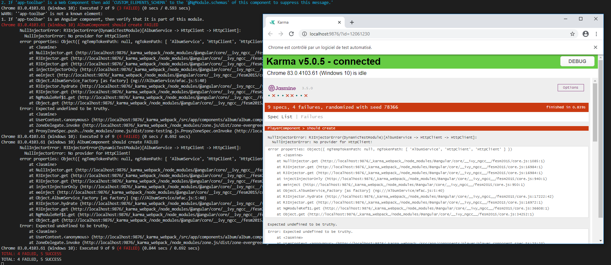
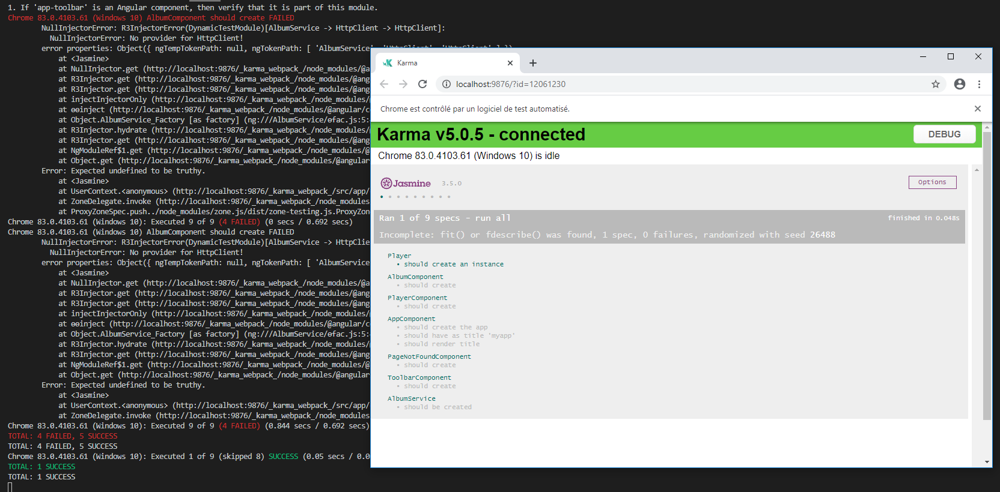
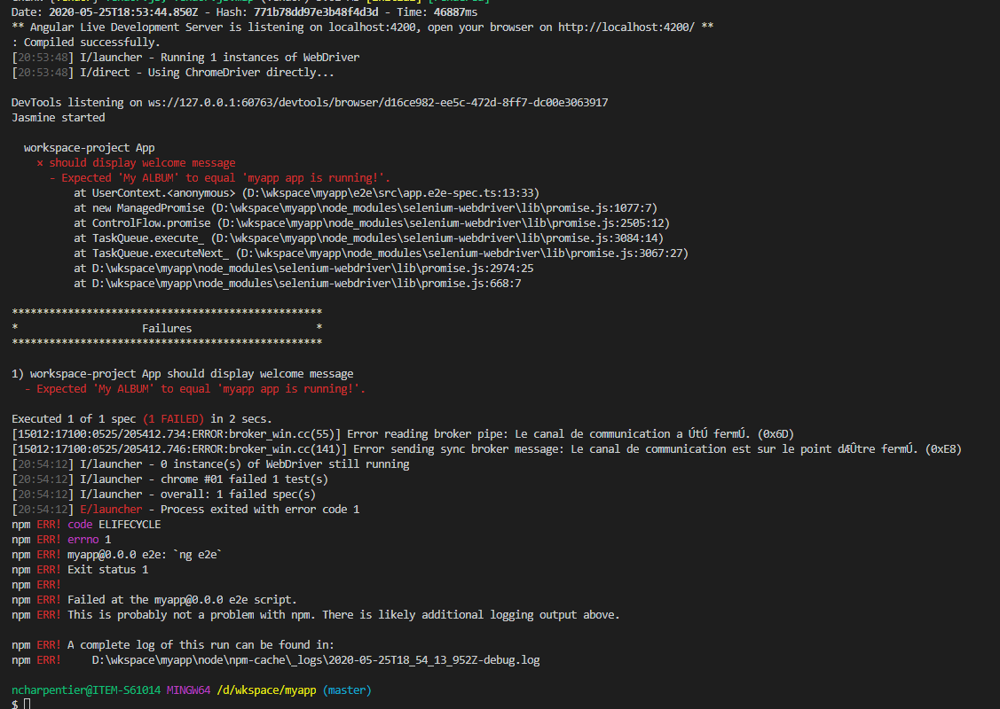
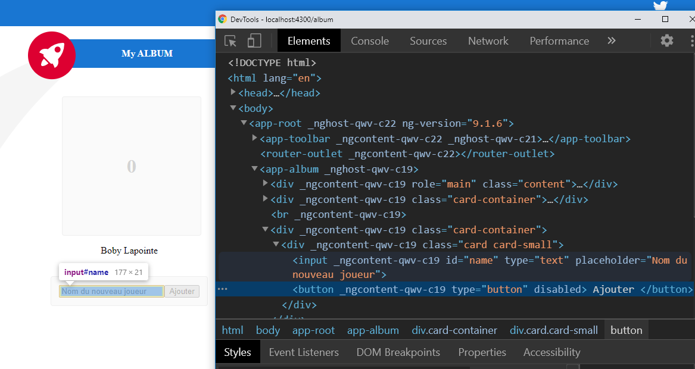
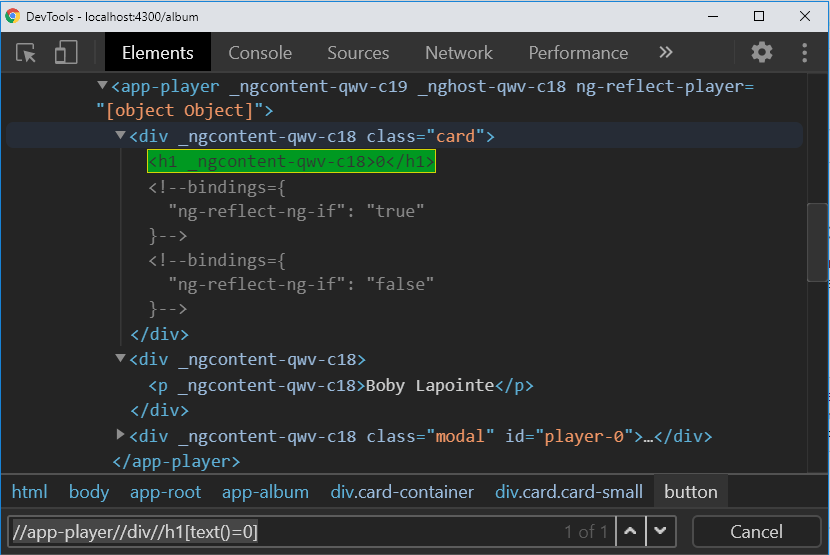

# TP 3 - Création d'un album avec Angular

Objectifs de ce TP :

- Aborder les tests unitaires avec Karma et Jasmine
- Aborder les tests end-to-end (e2e) avec Protractor et Jasmine


## Pré-requis

`/!\ CONSERVEZ VOS MODIFICATIONS, CREEZ UNE COPIE SI VOUS SOUHAITEZ EVITER DE LES PERDRE`

Récupérez le squelette du TP2 sans vos modifications. Pour vous faciliter la tâche, vous pouvez choisir de le copier dans un nouveau répertoire afin de CONSERVER vos modifications pour y revenir plus tard (ou bien stashez vos modifications si vous êtes à l'aise avec git ;-)) et vous n'aurez pas besoin du backend.

Si vous avez choisi d'opter pour une copie vous aurez sans doute besoin de lancer la commande `npm install`.

Utiles,

- la documentation jasmine pour la syntaxe : https://jasmine.github.io/,
- la documentation protractor pour les interactions avec le DOM : https://www.protractortest.org/#/api

## Tests unitaires

Les tests unitaires c'est la vie, c'est la base de tout développement, sinon bonjour les dégâts à chaque évolution ! Les tests unitaires permettent de vérifier le comportement d'une fonction/d'un élément précise/précis et non de l'ensemble de l'application. Ils permettent en cas d'évolution de sécuriser la maintenance en évitant les régressions et de trouver les erreurs rapidement.

Angular fait les choses biens, et par chance, grâce à l'utilisation d'Angular CLI, celui-ci vous a généré un fichier de tests à chaque élément généré (composant, service, directive, pipe, ...). Ces fichiers de tests sont représentés sour la forme `{element}.spec.ts` et doivent respecter cette extension pour être lancés par le moteur de tests.

Karma est un moteur de lancement des tests unitaires (test runner). Jasmine est un framework javascript de tests (langage, syntaxe, ...).

### Votre premier test unitaire

Commençons par le plus simple, essayons de tester le constructeur du modèle Player (`models/player.ts`).

```
export class Player {
  image: string;
  date: Date;
  constructor(public id: number = 0, public name: string = 'undefined') {}
}

```

1. Ouvrez le fichier de test associé `models/player.spec.ts`

```
import { Player } from './player';

describe('Player', () => {
  it('should create an instance', () => {
    expect(new Player()).toBeTruthy();
  });
});
```

2. Lancez les tests avec la commande `npm test` dans un terminal au niveau du `package.json`

Le moteur de test Karma va prendre en charge l'analyse des fichiers \*.spec.ts situé dans les sources et exécuter chaque test. Une fenêtre navigateur doit s'ouvrir et afficher un rapport de test. Gardez cette fenêtre ouverte et ne fermez pas le terminal car Karma observe les fichiers pour relancer les tests dès qu'une modification est effectuée. Plusieurs tests devraient être en erreur, ceux-ci ne nous intéresse pas dans un premier temps.



3. Nous allons exécuter uniquement les tests du modèle Player. Modifier le fichier `player.spec.ts` pour remplacer `describe` par `fdescribe`, l'ajout d'un f permet de focus Karma sur un scope (pour info le f peut aussi être appliqué à un `it` -> `fit` pour exécuter uniquement certains tests du describe).

```
import { Player } from './player';

fdescribe('Player', () => {
  it('should create an instance', () => {
    expect(new Player()).toBeTruthy();
  });
});
```

4. Observez, il ne devrait y'avoir qu'un seul test exécuté et en succès.



5. Créez votre premier test en testant le constructeur du modèle et en vérifiant qu'un Player s'initalise avec un identifiant égal à zéro et un name égal à 'undefined'. (https://jasmine.github.io/)

```
import { Player } from './player';

fdescribe('Player', () => {
  it('should create an instance', () => {
    expect(new Player()).toBeTruthy();
  });

  it('should create a player with a name = undefined and a id = 0', () => {
    const myPlayer = new Player();

    expect(myPlayer.name).toBe('undefined');
    expect(myPlayer.id).toBe(0);
  });
});
```

6. Créez votre second test en testant le constructeur Player initialisé avec un nom valide et un identifiant différent de 0. Vérifiez qu'il valorise correctement les attributs name et identifiant avec votre test.

### Testons notre service Album

1. Ouvrez les fichiers `album.service.ts` et `album.service.spec.ts`
2. Enlever le f du describe du player et rajouter le au describe du test du service (`fdescribe` pour exécuter uniquement les tests du service album).
3. Observez la différence, le service est injecté au niveau des tests étant donné que l'application n'est pas démarrée (rappelez-vous du dependency injection).

```
import { TestBed } from '@angular/core/testing';

import { AlbumService } from './album.service';

fdescribe('AlbumService', () => {
  let service: AlbumService;

  beforeEach(() => {
    TestBed.configureTestingModule({});
    service = TestBed.inject(AlbumService);
  });

  it('should be created', () => {
    expect(service).toBeTruthy();
  });
});
```

```
/!\ Bon à savoir, les éléments @Injectable doivent être injectés au niveau des éléments les utilisant lors des tests (exemple avec le service HttpClient).

Un bon article ici : https://guide-angular.wishtack.io/angular/testing/unit-testing/unit-test-et-httpclient
```

4. Ajoutez une méthode getAlbumSize() au service `album.service.ts` permettant de retourner le nombre de joueurs.

```
  getAlbumSize(): number {
    return this.players.length;
  }
```

5. Recopiez le fichier `album.service.spec.tc` ci-dessous et complétez la ligne 35 (`// Your code here`) pour que le test soit passant :

```
import { TestBed } from '@angular/core/testing';
import { async } from '@angular/core/testing';

import { AlbumService } from './album.service';
import { Observable, Subscription } from 'rxjs';
import { Player } from '../models/player';

fdescribe('AlbumService', () => {
  let service: AlbumService;
  let obs: Observable<Player[]>;

  beforeEach(() => {
    TestBed.configureTestingModule({});
    service = TestBed.inject(AlbumService);
    obs = service.getPlayers();
  });

  it('should be created', () => {
    expect(service).toBeTruthy();
  });

  // Le mot clé Async va forcer jasmine a attendre la fin des évènements asynchrones (observable)
  it('should create one player', async(() => {
    expect(service.getAlbumSize()).toBe(0);
    obs.subscribe((players: Player[]) => {
      console.log('Test');
      console.log(players);
      if (players.length === 1) {
        expect(
          players.find((player) => player.name === 'Bob').id === 2
        ).toBeTrue();
      }
    });

    // Your code here

    expect(service.getAlbumSize()).toBe(1);
  }));
});

```

6. [OPTIONNEL si vous êtes en avance et que vous avez fini les deux premiers TPs, SINON rendez-vous au chapitre Tests ent-to-end directement]. Modifiez le test pour qu'il vérifie l'ajout de deux players (deux différents) à l'album (à la fin du test il faut que la taille du tableau est égale à 2 et que l'observable à bien été déclenché deux fois).

## Tests end-to-end (e2e)

Contrairement aux tests unitaires, les tests end-to-end (e2e ou tests fonctionnels) vérifient que l'ensemble de l'application fonctionne correctement. À la manière d'un utilisateur qui navigue sur votre application, les tests end-to-end décrivent des scénarios et vérifient les comportements. Ils sont aussi pratiques que les tests unitaires (maintenance, non régression, ...).

À la différence des tests unitaires, les tests e2e ont besoin que l'application démarre et ont besoin d'intéragir avec le DOM et votre backend (ou un stub, autrement appelé bouchon/mock). Sur un vrai projet, plusieurs configurations seraient nécessaires pour lancer correctement les tests. Dans le cadre du TP, le backend n'est pas nécessaire étant donné que les appels APIs ne sont pas encore implémentés. Un driver est utilisé pour simuler un navigateur. Par défaut, celui configuré est chrome (voir le fichier `protractor.conf.js`). Assurez-vous d'avoir ce navigateur pour que les tests se lancent correctement.

Les tests sont implémentés également avec le framework Jasmine mais cette fois-ci le moteur est Protractor. Angular fait encore les choses bien et à prévu l'endroit pour développer vos tests e2e sous le répertoire /e2e. À l'initialisation deux fichiers sont crées :

- `app.e2e-spec.ts` le scénario test a éxécuté,
- `app.po.ts` le 'page object' référencant des fonctions utiles liées à la récupération d'objet du DOM pour vos tests.

### Votre premier test e2e

1. Ouvrez un terminal et lancez les tests avec la commande `npm run e2e`.

La commande est assez longue surtout pour le premier lancement car il va télécharger le driver chrome, compiler et servir l'application sur le port 4200.

```
/!\ À noter que si votre application est déjà démarrée le port 4200 sera déjà utilisé, n'oubliez pas de fermer votre application ou de l'ouvrir sur un port différent.
```

Un navigateur chrome a dû se lancer avec l'application ouverte faire un test rapidement et se refermer. Si ce n'est pas le cas vous avez sans doute un problème d'installation du driver (à voir au cas par cas).

Un test exactement a dû s'exécuter et doit être en echec.



2. Que fait ce test ? Ouvrez les fichiers `app.e2e-spec.ts` et `app.po.ts`, observez l'implémentation et tentez de corriger le test sans modifier le code source de l'application.

```
/!\ La modification est à effectuer dans le fichier app.e2e-spec.ts.
```

### Un test e2e un peu plus complet

```
Note : Le framework est le même que celui des tests unitaires, vous pouvez utiliser fdescribe ou fit dans les tests e2e également grâce à Jasmine ;-) !
```

L'objectif ici est que nous allons tester le comportement de l'application face à un utilisateur qui ajoute un player 'Boby Lapointe' à son album. Voici les étapes descriptives.

```
1. L'utilisateur se connecte à l'application
2. L'utilisateur clique sur l'endroit pour "Ajouter un joueur"
3. L'utilisateur tape le nom du joueur 'Boby Lapointe'
4. L'utilisateur clique sur le bouton "Ajouter"
5. Une carte de joueur 'Boby Lapointe' apparaît à son album avec un identifiant '0'.
```

Il ne manque plus qu'a l'implémenter. Let's go !

1. Créez un nouveau test dans le fichier `app.e2e-spec.ts` (nouveau `it`, pour gagner du temps, j'utilise le `f` sur le `it` (`fit`) pour exécuter uniquement ce test lors du lancement).

```
  fit('should add Boby Lapointe as a player in the album', () => {
    // Code here
  });
```

2. Implémentez la connexion de l'utilisateur à l'application.

```
  fit('should add Boby Lapointe as a player in the album', () => {
    // Code here
    page.navigateTo();
  });
```

3. Pour cette troisième étape nous allons implémenter le clic sur l'endroit pour "Ajouter un joueur", le tape "Boby Lapointe" et le clic sur le bouton "Ajouter".

```
/!\ Pour vous aider, démarrez votre application sur un port différent
Exemple : dans mon package.json je spécifie le port 4300 pour démarrer mon application.

    "start": "ng serve --port 4300",


Ouvrez ensuite votre application, faite les étapes du tests avec votre souris et votre clavier et observez le DOM grâce aux outils développeurs de votre navigateur.
```



Ici, nous pouvons voir que le "Nom du nouveau joueur" est dans une div avec un id="name", nous allons donc implémenter le clic sur cette div. Le tape "Boby Lapointe" est un évènement clavier et le bouton "Ajouter" est contenu dans une balise "button" avec sa valeur = "Ajouter".

Le test dans le fichier `app.e2e-spec.ts` va donc ressembler à ça :

```
  fit('should add Boby Lapointe as a player in the album', () => {
    // Code here
    page.navigateTo();
    // Clique sur ajouter un joueur et complète le texte
    page.ajouterUnJoueur('Boby Lapointe').then(() => {
      // Clique sur le bouton "Ajouter" (inner text du button)
      page.clickAjouterBouton();
    });
  });
```

Maintenant implémentons nos fonctions "utils" pour intéragir avec le DOM (fichier `app.po.ts`).

Voici la doc des APIs de Protractor pour jouer avec le DOM : https://www.protractortest.org/#/api.

Voici le fichier `app.po.ts` avec ses fonctions implémentées :

```
import { browser, by, element, ExpectedConditions } from 'protractor';

export class AppPage {
  navigateTo(): Promise<unknown> {
    return browser.get(browser.baseUrl) as Promise<unknown>;
  }

  getTitleText(): Promise<string> {
    return element(by.css('app-root .content span')).getText() as Promise<
      string
    >;
  }

  ajouterUnJoueur(name: string): Promise<void> {
    return element(by.id('name')).sendKeys(name) as Promise<void>;
  }

  clickAjouterBouton(): Promise<void> {
    return element(by.buttonText('Ajouter')).click() as Promise<void>;
  }
}
```

4. Relancez les tests pour vérifier que le scénario fonctionne.
5. À la suite du test, ajoutez les éléments de vérification (expect) pour s'assurer que le joueur est bien ajouté à l'album. Nous allons pour cela utiliser une ExpectedConditions car le DOM va se rafraîchir de manière asynchrone, il faut nous assurer que l'élément à eu le temps d'apparaître, nous lui laisserons 5 secondes (imaginez qu'il y a un gros appel API qui dure longtemps !).

Objectif :

Le code du test de `app.e2e-spec.ts` :

```
  fit('should add Boby Lapointe as a player in the album', () => {
    // Code here
    page.navigateTo();
    // Clique sur ajouter un joueur et complète le texte
    page.ajouterUnJoueur('Boby Lapointe').then(() => {
      // Clique sur le bouton "Ajouter" (inner text du button)
      page.clickAjouterBouton();
    });

    // On attend que le player est bien apparu avec l'identifiant, dans le cas où il n'est pas apparu
    // il tombera en timeout au bout de 5 secondes. (oui car dans la vraie vie, il y'a un appel et un retour API !)
    page.waitForPlayer('0');
    // On vérifie son nom
    expect(page.getPlayerNameAvecId('0')).toEqual('Boby Lapointe');
  });
```

Reste à faire : implémenter la fonction dans `app.po.ts`.

Pour vous aider voici la signature de la fonction qui doit être implémentée dans le fichier `app.po.ts` ainsi que la fonction d'attente, inspirez-vous de ce que vous voyez !
Implémentez la fonction getPlayerNameAvecId(id: string) pour retourner le nom du joueur concerné par l'identifiant passé en paramètre.

```
  /**
   * Attend 5 secondes que l'élément app-player avec l'`id` passé en paramètre s'affiche sur l'album.
   * @param id string : Identifiant du joueur à attendre
   */
  waitForPlayer(id: string): void {
    browser.wait(
      ExpectedConditions.visibilityOf(
        element(by.xpath(`//app-player//div//h1[text()=${id}]`))
      ),
      5000
    );
  }

  /**
   * Retourne le nom du joueur présent sur l'album.
   * @param id string : Identifiant du joueur
   */
  getPlayerNameAvecId(id: string): Promise<string> {
    return // your code here // ;
  }
```

Et avec les commentaires en plus ;) !

/!\ Bonne pratique : Il faut toujours documenter son code y compris les tests avec des commentaires pertinents :-).

```
/!\ Indice : vous pouvez utiliser `..` dans le sélecteur xpath pour récupérer l'élément parent.
Servez vous de vos outils développeurs du navigateur, avec Chrome, j'utilise le finder directement avec mes sélecteurs xpath pour vérifier que je sélectionne les bons éléments !
```



6. Relancez les tests jusqu'à tant que ça passe au vert, sinon corrigez :-). Good Luck !

```
Vous noterez que c'est plus facile de jouer avec des ids plutôt que de remonter et de redescendre un arbre d'éléments comme le DOM. Soyez malins dans vos développements frontend et utilisez au maximum les attributs html : id et name, assurez-vous que l'id soit unique !
```

## Bonus :

- Terminez les TP1 et TP2.
- Ajoutez un scénario de test e2e pour vérifier le comportement d'ajout d'une image à l'album.
- Implémentez une feature module de consultation de l'album en mode lecture seule, créez une route distincte et utilisez le lazy loading pour importer ce feature module.
